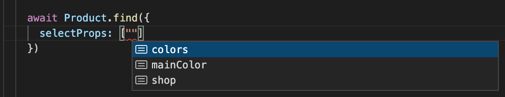

# Typescript Support


## type ModelRepository

Some IDE (like VSCode) can show typescript hints if the type `ModelRepository` is well-determined.

- Shows `Property` Suggestion in data query



- Shows the type of records found by Model API


For the `ORMConfig`, if you use `models` to register your Models, the type of `ModelRepository` can be determined automatically.

`ORMConfig` Example:
<CodeGroup>
  <CodeGroupItem title="TS" active>

```ts{5}
import Product from './models/product'

const orm = new ORM({
    models: {
        Product
    }
})

// p: ModelRepository<typeof Product>
let repo = orm.getContext().repos.Product
```
  </CodeGroupItem>
  <CodeGroupItem title="JS">

```js{3}
const orm = new ORM({
    models: {
        Product: require('./models/product')
    }
})

// p: ModelRepository<typeof Product>
let repo = orm.getContext().repos.Product
```
  </CodeGroupItem>
</CodeGroup>


But the `type` of the respository cannot be determined if `modelsPath` is used for Model registration.
If you want the typescript hints shown propertly, you have to get the `ModelRepository` by `Model` class so that the `type` can be inferred.


<CodeGroup>
  <CodeGroupItem title="TS" active>

```ts{7}
import Product from './models/product'

const orm = new ORM({
    modelsPath: './models'
})
// repo: ModelRepository<typeof Product>
let repo = orm.getContext().getRepository(Product)

let records = repo.find({
  select: ['prop1']
})

```
  </CodeGroupItem>
  <CodeGroupItem title="JS">

```js{5}
const orm = new ORM({
    modelsPath: './models'
})
// repo: ModelRepository<typeof Product>
let repo = orm.getContext().getRepository(require('./models/product'))

let records = repo.find({
  select: ['prop1']
})
```
  </CodeGroupItem>
</CodeGroup>

## type ModelRecord

## Circular dependencies


